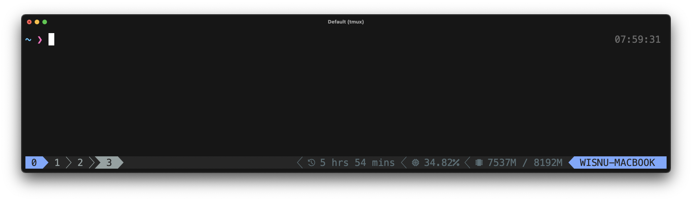

# TMUX Wakatime

This fork adds some better ux for when the cache is not available.

---

Shows [WakaTime](https://wakatime.com/) today statistics in the status line.



## Installation
### Requirements
* [jq](https://jqlang.github.io/jq/)
* [sed](https://github.com/mirror/sed)

### With Tmux Plugin Manager
Add the plugin in `.tmux.conf`:
```
set -g @plugin 'mattpetters/tmux-wakatime'
```
Press `prefix + I` to fetch the plugin and source it. Done.

### Manual
Clone the repo somewhere. Add `run-shell` in the end of `.tmux.conf`:

```
run-shell PATH_TO_REPO/tmux-wakatime.tmux
```
NOTE: this line should be placed after `set-option -g status-right ...`.

Press `prefix + :` and type `source-file ~/.tmux.conf`. Done.

## Usage
Add `#{wakatime}` somewhere in the right status line:
```
set-option -g status-right "#{wakatime}"
```
## License
tmux-wakatime plugin is released under the [Apache License](https://www.apache.org/licenses/LICENSE-2.0).
